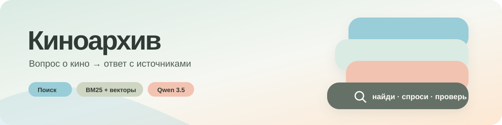
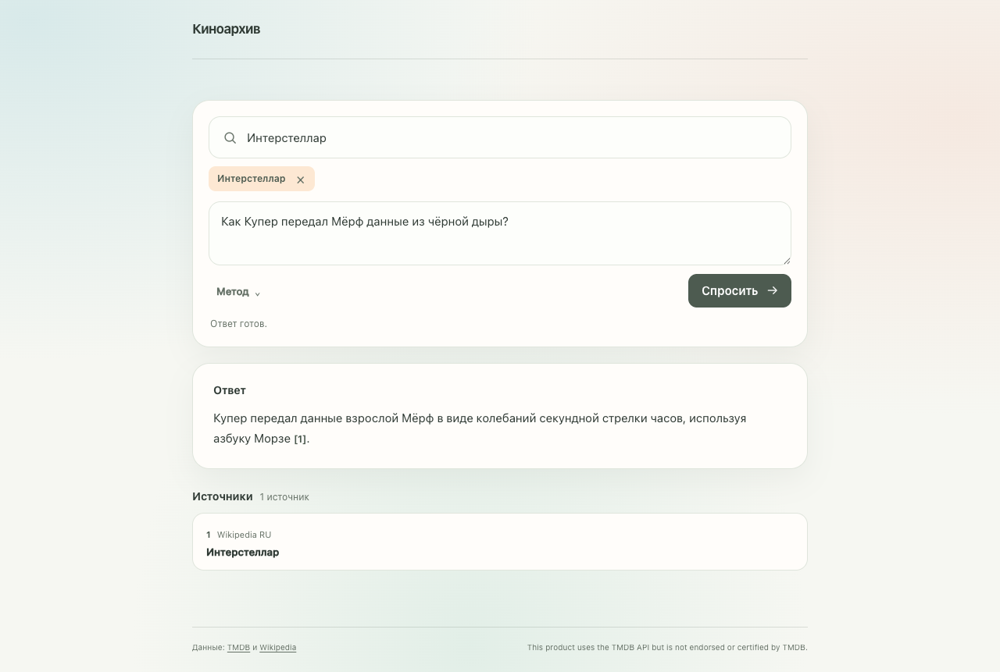
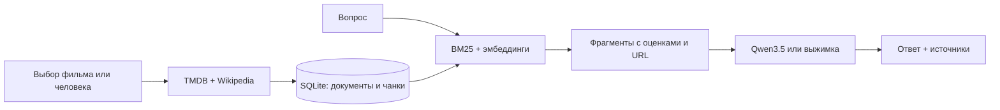

<p align="center">
  
</p>

<p align="center">
  <strong>Локальная RAG-система о фильмах, сериалах и людях кино.</strong><br>
  Выберите объект, задайте вопрос по-русски и получите ответ со ссылками на материалы, из которых он составлен.
</p>

<p align="center">
  <a href="demo/movie-rag-demo.mp4"><strong>▶ Смотреть демо</strong></a> ·
  <a href="#start"><strong>Быстрый запуск</strong></a> ·
  <a href="#how-it-works"><strong>Как работает</strong></a> ·
  <a href="#api"><strong>API</strong></a> ·
  <a href="#quality"><strong>Проверка качества</strong></a>
</p>

<p align="center">
  <a href="demo/movie-rag-demo.mp4">
    
  </a>
</p>

<p align="center"><sub>Нажмите на скриншот, чтобы открыть <a href="demo/movie-rag-demo.mp4">20-секундное видео рабочего сценария</a>.</sub></p>

---

## Что умеет

| Шаг | Что происходит |
| :-- | :-- |
| **1. Найти** | Интерактивный поиск по [TMDB](https://www.themoviedb.org/) находит фильм, сериал или человека. Есть фильтры, подсказки и недавние варианты. |
| **2. Загрузить** | Приложение сохраняет сведения TMDB и, если доступны, статьи [Wikipedia](https://www.wikipedia.org/) на русском и английском. Документы и фрагменты хранятся в SQLite. |
| **3. Спросить** | [BM25](movie_rag/db.py) и [семантический поиск](movie_rag/search.py) подбирают фрагменты. Локальная [Qwen3.5](https://ollama.com/library/qwen3.5) отвечает по ним на русском. |
| **4. Проверить** | Рядом с ответом показаны кликабельные источники. Без Ollama система выдаёт выжимку из найденных фрагментов. |

<a id="start"></a>
## Быстрый запуск

Нужны **Python 3.11+**, интернет для первой загрузки материалов и бесплатный ключ [TMDB API](https://developer.themoviedb.org/docs/getting-started). [Ollama](https://ollama.com/download) нужна для генерации; без неё доступен ответ-выжимка.

**1. Установите проект**

```bash
git clone https://github.com/dud0k3/movie-rag.git
cd movie-rag
python3 -m venv .venv
source .venv/bin/activate
pip install -e .
cp .env.example .env
```

**2. Заполните `.env`**

- Укажите **одно** из значений: `TMDB_API_KEY` или `TMDB_READ_ACCESS_TOKEN`.
- В `WIKIMEDIA_CONTACT_URL` укажите публичную ссылку на свой профиль или репозиторий — она используется в User-Agent согласно [правилам Wikimedia](https://foundation.wikimedia.org/wiki/Policy:Wikimedia_Foundation_User-Agent_Policy).
- `.env` исключён из Git и не должен попадать в коммиты.

**3. Если нужен ответ Qwen, подготовьте локальную модель**

```bash
ollama pull qwen3.5:9b
```

**4. Запустите приложение**

```bash
uvicorn movie_rag.app:app --reload
```

Откройте **[интерфейс](http://127.0.0.1:8000/)** или **[интерактивную документацию API](http://127.0.0.1:8000/docs)** на своём компьютере. Введите название, выберите результат из меню и задайте вопрос. Фильм загрузится при выборе — предварительная загрузка каталога для этого сценария не нужна.

<details>
<summary><strong>Необязательно: загрузить стартовый каталог и построить индекс</strong></summary>

```bash
python -m movie_rag.cli seed --count 100
python -m movie_rag.cli enrich-ru
python -m movie_rag.cli reindex
```

Первый запуск может занять время: материалы запрашиваются у внешних сервисов, а модель эмбеддингов скачивается локально. Содержимое `data/` и ключи в репозиторий не включены.

</details>

<a id="how-it-works"></a>
## Как это работает



Текст делится на фрагменты примерно по **480 слов** с перекрытием **80 слов**. [SQLite FTS5](movie_rag/db.py) даёт быстрый BM25, [Sentence Transformers](movie_rag/search.py) — поиск по смыслу; результаты объединяются методом reciprocal rank fusion. Дополнительно можно установить FAISS, иначе векторный поиск работает через NumPy. Перед генерацией система выбирает короткие фрагменты, относящиеся к конкретному вопросу.

**Где находится логика:** [сбор данных](movie_rag/sources.py) · [чанкинг](movie_rag/chunking.py) · [база](movie_rag/db.py) · [поиск](movie_rag/search.py) · [выбор доказательств](movie_rag/evidence.py) · [ответ](movie_rag/answer.py) · [сервер](movie_rag/app.py) · [интерфейс](movie_rag/static/).

<a id="api"></a>
## API

После запуска сервера все методы можно попробовать в **[Swagger UI](http://127.0.0.1:8000/docs)**.

| Метод | Назначение |
| :-- | :-- |
| `GET /discover?q=...` | Подсказки по фильмам, сериалам и людям. |
| `POST /ingest` | Загрузка выбранного объекта; `"refresh":true` повторяет сбор источников. |
| `GET /search?q=...&top_n=5&mode=hybrid` | Топ фрагментов со score, названием и URL. Доступны `bm25`, `semantic`, `hybrid`. |
| `GET /ask?q=...` | Готовый ответ и список источников. |
| `GET /ask/stream?q=...` | Источники и ответ по мере генерации через NDJSON. |
| `GET /health` | Состояние приложения и размеры базы. |

<details>
<summary><strong>Пример полного сценария через API</strong></summary>

```bash
curl --get 'http://127.0.0.1:8000/discover' --data-urlencode 'q=Интерстеллар'

curl -X POST 'http://127.0.0.1:8000/ingest' \
  -H 'Content-Type: application/json' \
  -d '{"type":"movie","id":157336}'

curl --get 'http://127.0.0.1:8000/ask' \
  --data-urlencode 'q=Как Купер передал Мёрф данные?' \
  --data-urlencode 'entity_type=movie' \
  --data-urlencode 'entity_id=157336'
```

</details>

<a id="quality"></a>
## Проверка качества

```bash
python -m unittest discover -s tests -q
python -m evaluation.evaluate
```

| Режим | Recall@1 | Recall@5 | Recall@10 |
| :-- | --: | --: | --: |
| BM25 | 0,90 | **1,00** | **1,00** |
| По смыслу | 0,50 | 0,60 | 0,70 |
| Гибридный | 0,50 | 0,90 | **1,00** |

Это результаты на **[10 контрольных вопросах](evaluation/questions.json)** по загруженным фильмам; подробные ранги — в **[результатах оценки](evaluation/results.json)**. Recall@K показывает, найден ли чанк нужного фильма среди первых K результатов. Метрика не доказывает фактическую точность текста Qwen — её нужно проверять по ссылкам в ответе. Автоматических тестов: **34** ([исходники](tests/test_core.py)).

## Демо и ограничения

- **[Видео рабочего сценария](demo/movie-rag-demo.mp4)** показывает поиск «Интерстеллара», выбор фильма, вопрос, русский ответ и источник. Сценарий записи доступен в **[scripts/record_demo.py](scripts/record_demo.py)**.
- Первая загрузка нового фильма зависит от скорости TMDB и Wikipedia. Если Wikipedia временно не ответила, повторите `POST /ingest` с `"refresh":true`: описание TMDB останется доступным, но может быть недостаточно для подробного сюжетного ответа.
- Локальная модель может ошибаться даже при наличии ссылок. На MacBook Air M4/16 ГБ один проверенный короткий ответ занял 2,8 секунды, более сложные — 8–13 секунд; это не гарантированная задержка.
- База, ключ TMDB и загруженные модели остаются на компьютере и не входят в репозиторий.

---

<sub>This product uses the TMDB API but is not endorsed or certified by TMDB. Данные: <a href="https://developer.themoviedb.org/docs/getting-started">TMDB</a> и <a href="https://www.mediawiki.org/wiki/API:REST_API/Reference">Wikipedia</a>. Генерация: <a href="https://ollama.com/">Ollama</a> и <a href="https://ollama.com/library/qwen3.5">Qwen3.5</a>.</sub>
