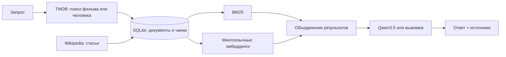

# Киноархив: RAG по фильмам и людям кино

Учебная система «собрал материалы → нашёл фрагменты → ответил с источниками». Пользователь выбирает фильм, сериал, режиссёра или актёра, задаёт вопрос на русском языке и получает ответ со ссылками на TMDB и Wikipedia. Незнакомые фильмы, сериалы и люди загружаются по запросу и сохраняются для повторного использования.

## Возможности

- **Сбор данных:** TMDB API для русских и оригинальных названий, описаний, дат, актёров, персонажей сериалов и съёмочной группы; русская и английская Wikipedia REST API для биографий и истории создания.
- **База:** SQLite с документами (`title`, `url`, `text`, `published_at`, `fetched_at`, источник и хеш текста), сущностями и чанками.
- **Чанкинг:** около 480 слов с перекрытием 80 слов.
- **Поиск:** SQLite FTS5/BM25, многоязычные эмбеддинги Sentence Transformers, объединение результатов по reciprocal rank fusion. Если установлен FAISS, векторный поиск использует его; иначе достаточно NumPy.
- **Ответ:** локальная Qwen3.5 9B через Ollama получает короткие фрагменты, выбранные под конкретный вопрос, и отвечает по-русски с номерами источников. Если модель недоступна, работает выжимка из найденных фрагментов.
- **Потоковый вывод:** интерфейс показывает текст по мере генерации через `/ask/stream`. Первые слова обычно появляются через несколько секунд после прогрева моделей; полный ответ занимает больше времени.
- **Оценка:** набор вопросов и Recall@1/5/10 по трём режимам поиска.

## Схема



## Запуск

Требуются Python 3.11+, интернет для первого сбора данных, бесплатный ключ TMDB и, для генерации, [Ollama](https://ollama.com/download).

```bash
git clone https://github.com/dud0k3/movie-rag.git
cd movie-rag
python3 -m venv .venv
source .venv/bin/activate
pip install -e .
cp .env.example .env
```

В `.env` укажите **одно** из значений: `TMDB_API_KEY` (API Key v3) либо `TMDB_READ_ACCESS_TOKEN` (API Read Access Token). Не публикуйте `.env` и не вставляйте ключ в исходный код. Для Wikipedia укажите публичную ссылку на профиль или репозиторий в `WIKIMEDIA_CONTACT_URL`: она используется в User-Agent согласно [правилам Wikimedia](https://foundation.wikimedia.org/wiki/Policy:Wikimedia_Foundation_User-Agent_Policy).

Загрузите начальный каталог и постройте семантический индекс:

```bash
python -m movie_rag.cli seed --count 100
python -m movie_rag.cli reindex
```

Первое построение индекса скачивает локальную модель эмбеддингов. Начальный каталог выбирается среди вышедших зарубежных фильмов с большим числом оценок в TMDB. Повторный запуск обновляет изменившиеся документы по URL и хешу текста.

Для ранее собранной базы можно отдельно добавить русские статьи: `python -m movie_rag.cli enrich-ru`, затем повторить `python -m movie_rag.cli reindex`.

Для генерации ответа установите Ollama и загрузите модель:

```bash
ollama pull qwen3.5:9b
```

Запустите сервер:

```bash
uvicorn movie_rag.app:app --reload
```

Откройте <http://127.0.0.1:8000>. API доступно на <http://127.0.0.1:8000/docs>.

## API

| Endpoint | Что делает |
| --- | --- |
| `GET /discover?q=...` | Ищет фильм или человека в TMDB. |
| `POST /ingest` | Загружает выбранный объект: `{"type":"movie","id":27205}` или сериал `{"type":"tv","id":234763}`. |
| `GET /search?q=...&top_n=5&mode=hybrid` | Возвращает чанки, оценки и ссылки. `mode`: `bm25`, `semantic`, `hybrid`. |
| `GET /ask?q=...` | Отвечает по найденным фрагментам и возвращает источники. Можно передать `entity_type` и `entity_id`. |
| `GET /ask/stream?q=...` | Передаёт источники, фрагменты ответа и итог через NDJSON для быстрого отображения в интерфейсе. |
| `GET /health` | Показывает состояние и размеры базы. |

Пример полного сценария: найдите «Interstellar» через `/discover`, возьмите `id` результата, вызовите `/ingest`, затем задайте `/ask?q=Кто снял фильм и как проходили съёмки?&entity_type=movie&entity_id=157336`. Для персонажа сериала выберите результат типа `tv`; данные о персонажах и исполнителях загружаются из TMDB.

## Проверка качества

```bash
python -m unittest discover -s tests -v
python -m evaluation.evaluate
```

Скрипт оценки сохраняет `evaluation/results.json`. Recall@K означает долю вопросов, для которых среди первых K чанков нашёлся хотя бы один чанк нужного фильма. Это оценка **поиска**, а не фактической точности ответа; ответы проверяются отдельно вручную по приведённым ссылкам.

На начальном каталоге из 100 фильмов и 10 контрольных вопросов: BM25 дал Recall@5 = 1.0, гибридный поиск — Recall@5 = 0.9 и Recall@10 = 1.0. Числа зависят от наполнения TMDB/Wikipedia и сохранены в `evaluation/results.json`.

## Демо-видео

Готовая [видеодемонстрация](demo/movie-rag-demo.mp4) показывает поиск «Интерстеллара», выбор фильма, вопрос, русский ответ Qwen и ссылки на источники. При запущенном сервере её можно перезаписать командой `python scripts/record_demo.py`. Для этого дополнительно нужны `pip install playwright`, `python -m playwright install ffmpeg`, Chromium (`python -m playwright install chromium`) и системная утилита `ffmpeg`. На macOS можно использовать установленный Яндекс Браузер без отдельной загрузки Chromium: `DEMO_CHROME=/Applications/Yandex.app/Contents/MacOS/Yandex python scripts/record_demo.py`.

## Ограничения

- Статьи Wikipedia и поля TMDB заполнены не для каждого фильма и человека. При отсутствии русскоязычных материалов резервная выжимка сообщает о нехватке данных; Qwen может использовать и перевести английский источник.
- Поиск новых объектов требует интернет. Уже собранная база и ответы без обновления доступны локально.
- TMDB и Wikipedia предоставляют данные на собственных условиях. База, ключи и загруженная модель не включены в Git-репозиторий.
- Локальная модель может допустить ошибку; номера источников позволяют проверить утверждения. Если она забывает ссылку, приложение добавляет её только к предложениям с достаточным совпадением с найденным фрагментом. При отсутствии подтверждения используется выжимка.
- На MacBook Air M4 с 16 ГБ памяти первые слова в проверенных тёплых запросах появлялись примерно за 0,5–3 секунды, полный ответ — за 5–10 секунд. Это наблюдения, а не гарантированное время для любого нового фильма или вопроса: первая загрузка фильма и модели занимает дольше.

## Источники и атрибуция

This product uses the TMDB API but is not endorsed or certified by TMDB.

- [TMDB API](https://developer.themoviedb.org/docs/getting-started), [условия использования и атрибуция](https://developer.themoviedb.org/docs/faq)
- [MediaWiki REST API](https://www.mediawiki.org/wiki/API:REST_API/Reference)
- [Ollama](https://ollama.com/), [Qwen3.5](https://ollama.com/library/qwen3.5)
